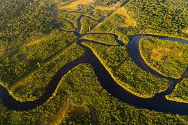
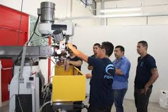

<!DOCTYPE html>
<html lang="pt-br">
<head>
    <meta charset="UTF-8">
    <meta name="viewport" content="width=device-width, initial-scale=1.0">
    <title>Início Biomas da Amazônia</title>
    
</head>
<body>

<header>
    <h1>Início Biomas da Amazônia</h1>
</header>
☰ Menu

    <a href="Biomas/projetos.html" onclick="toggleSidebar()">Projetos</a>
    <a href="Biomas/dados.html" onclick="toggleSidebar()">Dados da Poluição do Ar</a>
    <a href="Biomas/solucoes.html" onclick="toggleSidebar()">Soluções</a>

    <section id="introducao">
        <h2>Bem-vindo ao site Biomas da Amazônia</h2>
        
Aqui você encontrará informações sobre os projetos de monitoramento de poluição do ar e as soluções para combater o impacto ambiental.

    </section>

    <figure class="carousel">
        

            

                
            

            

                
            

            

                
            

            

                
            

            

                
            

        

        <button class="carousel-button prev" onclick="prevSlide()">❮</button>
        <button class="carousel-button next" onclick="nextSlide()">❯</button>
    </figure>
    <figcaption>Fig. 1 - Carrossel de imagens representando os temas de preservação e monitoramento dos biomas amazônicos.</figcaption>

</body>
</html>
