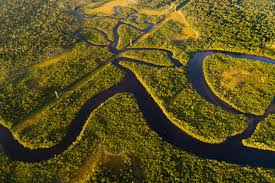

<!DOCTYPE html>
<html lang="pt-br">
<head>
    <meta charset="UTF-8">
    <meta name="viewport" content="width=device-width, initial-scale=1.0">
    <title>Início Biomas da Amazônia</title>
    
</head>
<body>

<header>
    ☰ Menu
    

    <a href="Biomas/projetos.html">Projetos</a>
    <a href="Biomas/dados.html">Dados da Poluição do Ar</a>
    <a href="Biomas/solucoes.html">Soluções</a>
    <a href="Biomas/ecomonitor.html">Ecomonitor</a>
        <a href="Biomas/jogo.html">jogo</a>
    

</header>

<section class="title-section">
    <h2>Feira Tecnológica - FUCAPI</h2>
    
Manaus, Brasil

    
Ecomonitor - NBE1

</section>

    <a href="Biomas/projetos.html" onclick="toggleSidebar()">Projetos</a>
    <a href="Biomas/dados.html" onclick="toggleSidebar()">Dados da Poluição do Ar</a>
    <a href="Biomas/solucoes.html" onclick="toggleSidebar()">Soluções</a>
    <a href="Biomas/ecomonitor.html" onclick="toggleSidebar()">Ecomonitor</a>
     <a href="Biomas/jogo.html" onclick="toggleSidebar()">jogo</a>

    <section id="introducao">
        <h2>Bem-vindo ao site Biomas da Amazônia</h2>
        
Recentemente secas históricas acontecem com mais frequência...

    </section>

    <figure class="video-container">
        <iframe src="https://www.youtube.com/embed/4MJvepYiBVk" 
                title="YouTube video player" frameborder="0" 
                allow="accelerometer; autoplay; clipboard-write; encrypted-media; gyroscope; picture-in-picture; web-share" 
                allowfullscreen></iframe>
    </figure>
    <figcaption>Fig. 1 - Vídeo representando os temas de preservação e monitoramento dos biomas amazônicos.</figcaption>

    

        <h3>Linha do Tempo da Degradação Amazônica</h3>
        

            
            <input type="range" id="timelineSlider" min="1" max="6" value="1" oninput="updateTimeline()">
            

        

        
Ano: 2000 - Início da linha do tempo

    

    

        
        

    

</body>
</html>
